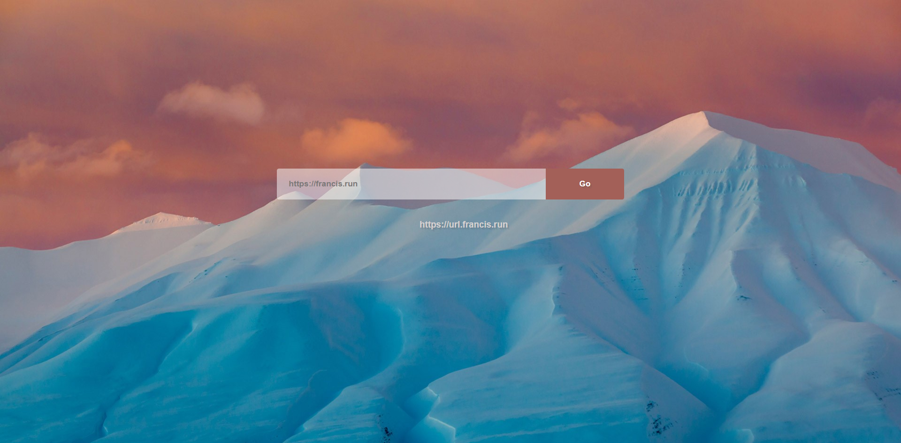

 
 
 
 
---
 
# URL-Shortener  

 

URL-Shortener is a simple url shortener that is build on Cloudflare Workers using Short.io API.

#### Web UI
- Open Website `https://short.francis.run`

- Paste the long link you want to shorten.

- Click the Go button to generate a short link.

#### Get request

- Request Url `https://short.francis.run`

- Request parameters and return response data

|  parameters  | description  | required |
|  ----  | ----  | ------- | 
| ?link=""  | link, which you want to shorten| Y|
| ?api="true" | Return json data - Required| Y |
| ?title="" |title of created URL to be shown in short.cm admin panel | N |
| ?path""  | optional path part of newly created link. If empty - it will be generated automatically | N |

